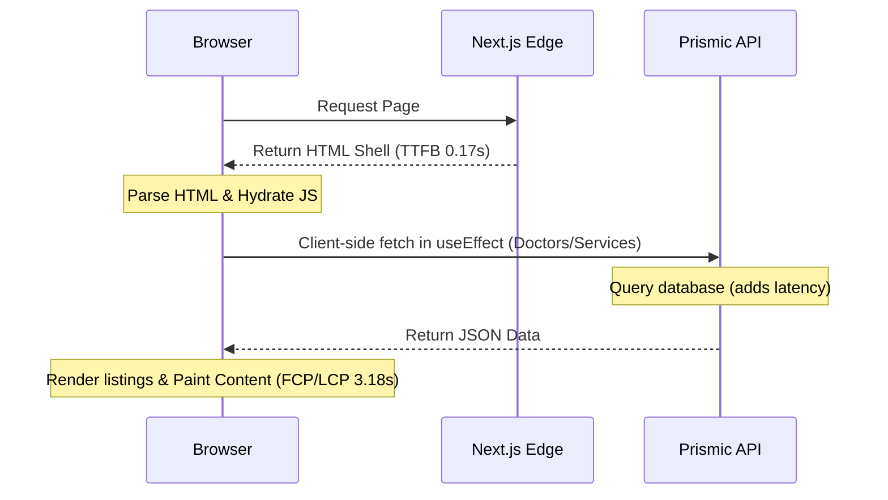
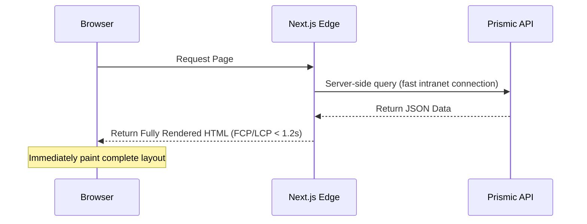

# Speed-up Plan: Next Steps for 95+ Performance Score

This document outlines the architectural plan to optimize the performance of the Dentamix website and achieve a **95+ (Green)** mobile and desktop score on Vercel Speed Insights / Lighthouse.

---

## Current Diagnostics & Progress

### 📈 Current State (Vercel Speed Insights)
* **Time to First Byte (TTFB)**: **~0.17s (Green)** — The server and edge networking are highly responsive.
* **First Contentful Paint (FCP) & Largest Contentful Paint (LCP)**: **~3.18s (Orange/Red)** — The browser takes over 3 seconds to paint the initial layout and primary content.

### ✅ Completed Optimizations (Completed in Phase 1)
* **Next.js `<Image>` Migration**: Replaced raw `` tags with optimized `<Image>` tags.
* **LCP Priority Loading**: Added the `priority` attribute to the Hero background image to force immediate preloading.
* **CDN Configuration**: Enabled Next.js automatic WebP/AVIF format conversion and caching for `images.prismic.io` assets.

---

## Speed-up Plan: Server-Side Data Fetching

The most impactful change to bring FCP and LCP down below **1.2s** is migrating from **Client-side Fetching** to **Server-side Fetching**.

### The Problem with the Current Architecture
Currently, pages render layout shells on the client side, then trigger `useEffect` hooks to fetch doctors and services from the Prismic API:

This client-side round-trip blocks the rendering of major portions of the page and forces the browser to display empty grids while waiting for the API.

---

### The Proposed Server-Side Fetching Architecture
By leveraging Next.js Server Components, we query the Prismic API on the server side. The server fetches the data and sends a fully populated HTML document directly to the client:


---

## Step-by-Step Implementation

### Step 1: Migrate Layout Fetching to Page Component
Instead of fetching data inside lists (`DoctorsList`, `ServicesList`) using client-side `useEffect`, fetch the data inside the server-side Page file:

```typescript
// src/app/[lang]/doctors/page.tsx
import { createClient } from '../../../prismicio';
import DoctorsClient from './DoctorsClient';

export default async function Page({ params }: PageProps) {
  const { lang } = await params;
  const locale = getPrismicLocale(lang);
  
  // Fetch from Prismic directly on the server
  const client = createClient();
  let doctors = [];
  try {
    const docs = await client.getAllByType('doctor', { lang: locale });
    doctors = docs.map(d => ({
      id: d.uid,
      name: d.data.name,
      // ... map fields
    }));
  } catch (error) {
    doctors = getDoctors(locale); // Fallback static data
  }

  // Pass ready-to-render data as props to the Client Component
  return <DoctorsClient doctors={doctors} langCode={locale} />;
}
```

### Step 2: Make Slice Components Server-Ready
For sections rendered via Prismic slices (e.g. `DoctorsList` inside page slices), remove `'use client'` from the components where possible, or pass the pre-fetched data directly through the Slice Context.

### Step 3: Implement Streaming with Suspense
If server-side fetching from Prismic is slow, utilize React `Suspense` and Next.js loading skeletons. This allows the browser to paint the page skeleton immediately while streaming the content dynamically as it resolves on the server:

```typescript
// src/app/[lang]/doctors/page.tsx
import { Suspense } from 'react';
import DoctorsSkeleton from './DoctorsSkeleton';
import DoctorsListServer from './DoctorsListServer';

export default async function Page({ params }) {
  return (
    <div>
      <Suspense fallback={<DoctorsSkeleton />}>
        <DoctorsListServer params={params} />
      </Suspense>
    </div>
  );
}
```

---

## Expected Results
* **FCP/LCP Reduction**: Down from **3.18s** to **< 1.2s**.
* **Zero Client API Requests**: Eliminated runtime round-trips to Prismic from the user's browser.
* **SEO Boost**: Search engine crawlers receive 100% of the text content on the first load without having to execute JavaScript.
